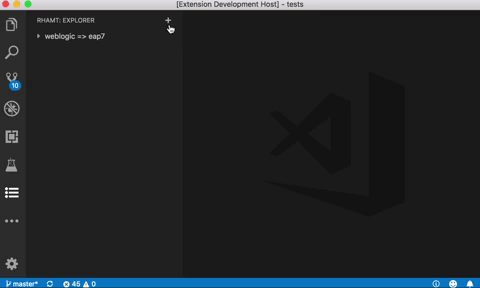

# Visual Studio Code RHAMT Extension

[](https://travis-ci.org/windup/rhamt-vscode-extension)
[](https://github.com/windup/rhamt-vscode-extension/blob/master/README.md)
[](https://marketplace.visualstudio.com/items?itemName=redhat.rhamt-vscode-extension)
[](https://marketplace.visualstudio.com/items?itemName=redhat.rhamt-vscode-extension)
[](https://marketplace.visualstudio.com/items?itemName=redhat.rhamt-vscode-extension)
## Description

The Visual Studio Code (VSCode) and Eclipse Che extension for the Red Hat Application Migration Toolkit (RHAMT).

RHAMT (the product of the downstream project [Windup](https://github.com/windup/windup)) is a command-line Application Migration and Modernization Assessment tool.

> The documentation for RHAMT can be found [here](https://developers.redhat.com/products/rhamt/overview).

## VSCode

This extension is published [here](https://marketplace.visualstudio.com/items?itemName=redhat.rhamt-vscode-extension) the Microsoft Visual Studio Marketplace.

To add this extension to a VSCode installation, open VSCode, navigate to the Extensions Marketplace View, and search using the keyword `'rhamt'`.

  

## Eclipse Che

This extension is supported in [Eclipse Che](https://www.eclipse.org/che/) `7.4.0` or higher.

To add this Che plugin to a workspace, open Che, navigate to the plugins tab, and search using the keyword `'migration'`.

  

Additionally, this [demo](https://github.com/johnsteele/che-rhamt-demo) can be used to quickly experiment with the Che plugin.

## Features

This extension provides support for performing application migrations using RHAMT.

#### Configuration Wizard
Use the configuration wizard to setup the analysis.  
  
  

#### Jump to Code
Jump to code containing identified migration issues.  
  
  

#### Issue Details
View details about the migration issue.  
  
  
  
#### Report
Get a high-level view of the migration.  
  
  

## Requirements

* Java Platform, `JRE version 8+` with `JAVA_HOME` environment variable 
* A minimum of `4 GB RAM`; 8 GB recommended
* Installation of the `rhamt-cli` (downloaded from [here](https://github.com/johnsteele/windup/releases/download/v0.0.1-alpha/rhamt-cli-4.2.0-SNAPSHOT-offline.zip)).

> Tip: You can optionally install the rhamt-cli once the extension has been installed.

## Extension Settings

This extension contributes the following settings:

* `rhamt.executable.path`: The location of the rhamt-cli. 

## Build

```bash
$ npm run compile
```
=======

## License
[MIT](LICENSE)
