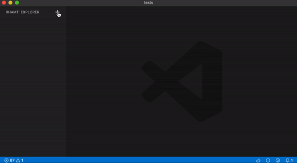
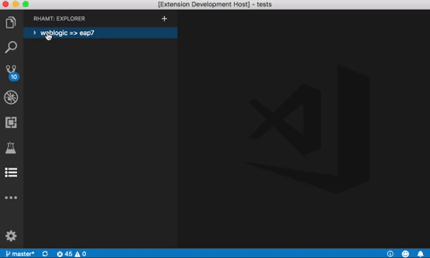
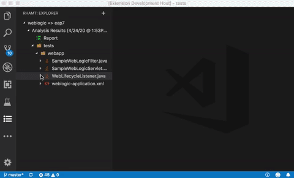
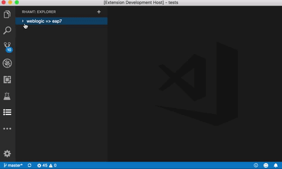

# Migration Toolkit for Applications (MTR) Visual Studio Code Extension

[](https://github.com/windup/rhamt-vscode-extension/blob/master/README.md)
[](https://marketplace.visualstudio.com/items?itemName=redhat.mta-vscode-extension)
[](https://marketplace.visualstudio.com/items?itemName=redhat.mta-vscode-extension)
[](https://marketplace.visualstudio.com/items?itemName=redhat.mta-vscode-extension)
## Description

VSCode extension for application migration and modernization using [Windup](https://github.com/windup/windup)).

## VSCode

This extension is published [here](https://marketplace.visualstudio.com/items?itemName=redhat.mta-vscode-extension) in the Microsoft Visual Studio Marketplace.


## Features

This extension provides the ability to analyze, assess, and migrate source code (using MTR) from within VSCode and Eclipse Che.

The look and feel of both VSCode and Eclipse Che are very similar; therefore, the functionality demonstrated below should be consistent between the two environments.

#### Configuration Editor
Use the configuration editor to setup the analysis.  
  
  

#### Jump to Code
Jump to code containing identified migration issues.  
  
  

#### Issue Details
View details about the migration issue.  
  
  
  
#### Report
Use the generated reports to better understand and assess the migration efforts.  
  
  

## Eclipse Che

This extension is supported in [Eclipse Che](https://www.eclipse.org/che/).

To add this plugin to a Che workspace, open Che, navigate to the plugins tab, and search using the keyword `migration`.

Alternatively, to add this plugin to a worksace, open Che, navigate to the Plugins view, and search for the `Migration Toolkit for Applications` plugin.

## Requirements

* Java Platform, `JRE version 11` with `JAVA_HOME` environment variable 
* A minimum of `4 GB RAM`; 8 GB recommended

> Tip: The cli can be installed from within VSCode once the extension has been installed.

## Extension Settings

This extension contributes the following settings:

* `cli.executable.path`: The location of the cli.

## Build

```bash
$ npm run compile
```
=======

## License
[MIT](LICENSE)
